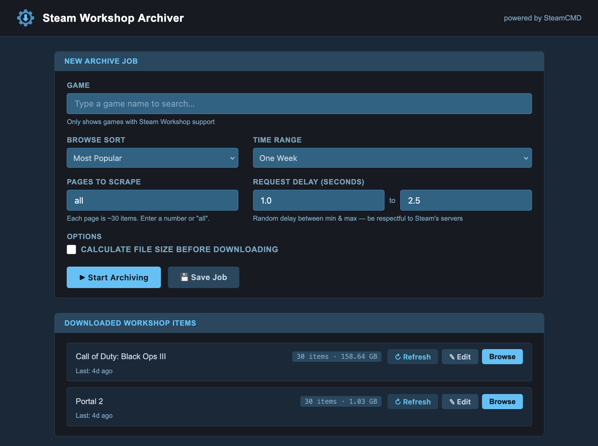
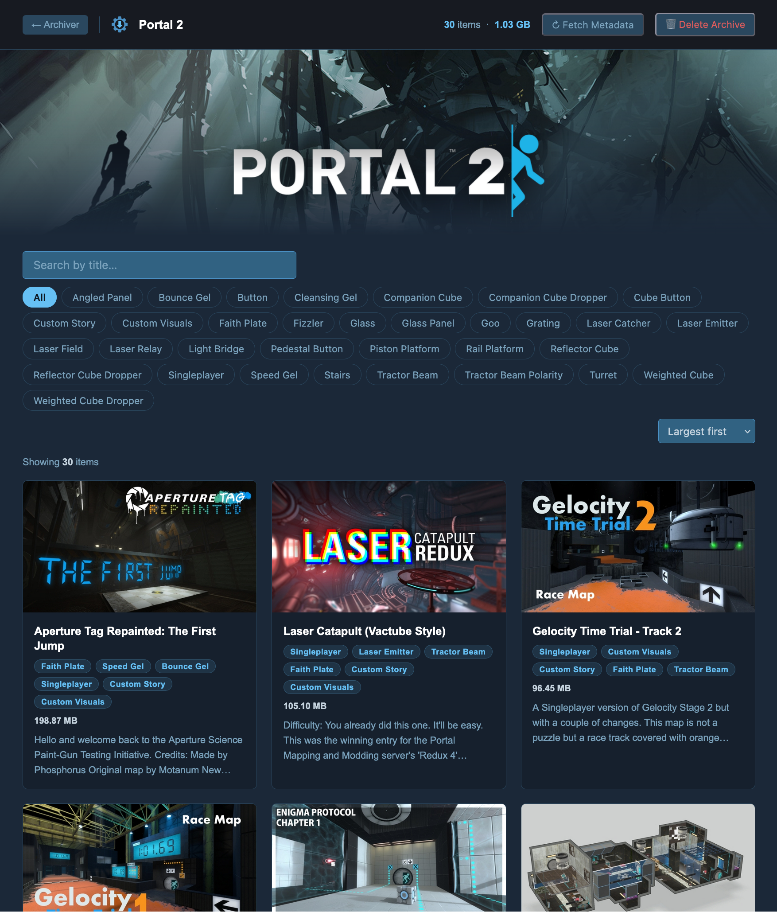
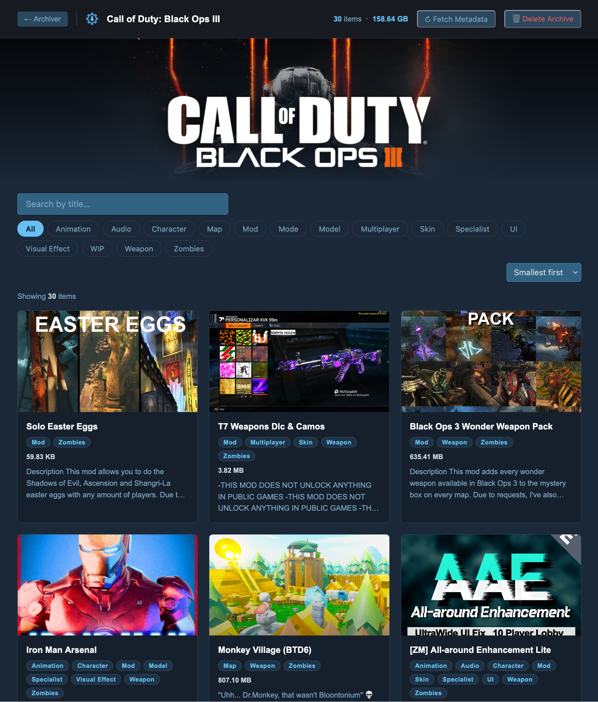
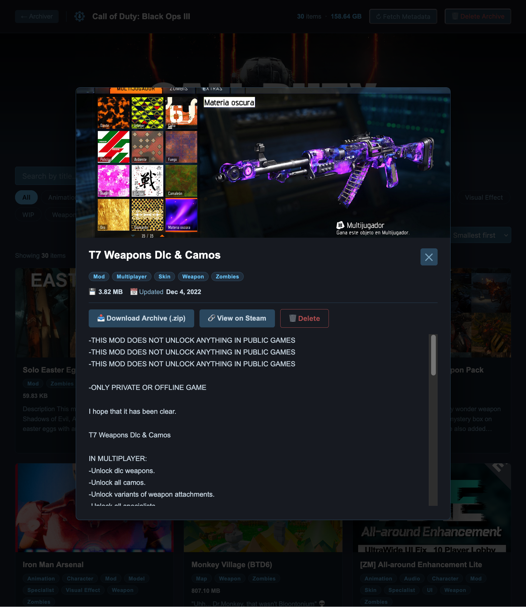
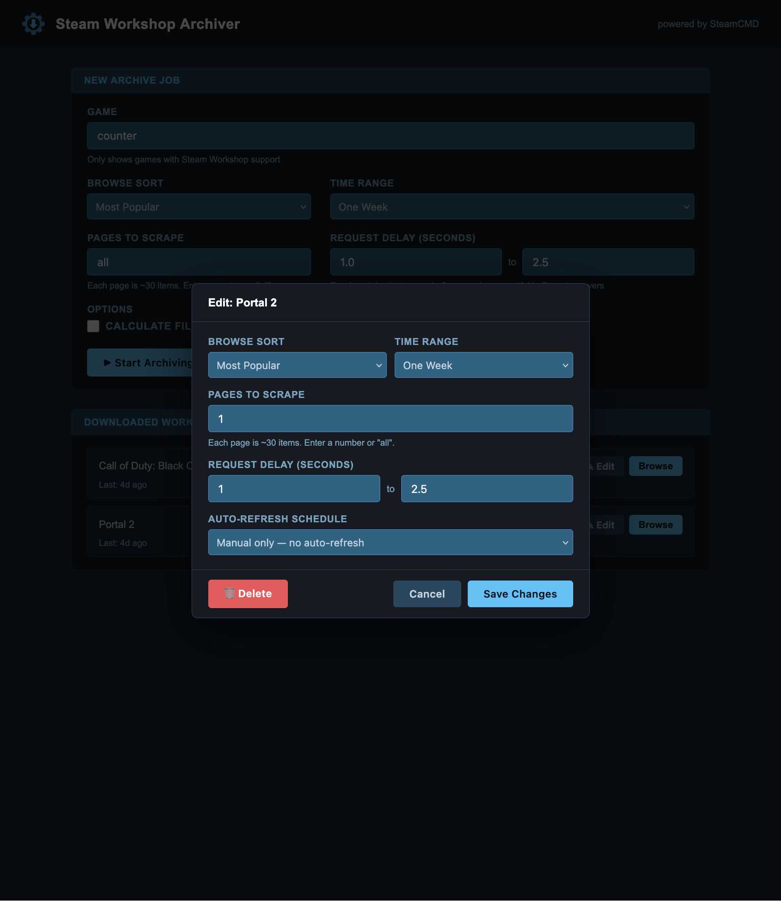

# Steam Workshop Archiver

A self-hosted web app for archiving Steam Workshop content. Scrape item lists, download them via SteamCMD, browse your collection, and keep everything up to date with scheduled jobs — all from a browser.

   



| | |
|---|---|
|  |  |
|  |  |

> **Vibe coded.** This is a vibe-coded project from start to finish. AI-assisted, minimal planning, zero ceremony. Functionally, it’s just a lightweight wrapper around SteamCMD with an archive browsing interface. It’s meant to be useful, not over-engineered.

---

## Features

- **Scrape & Download** — Search for any Steam game, scrape its Workshop item list, and download everything via SteamCMD (anonymous, no Steam account required)
- **Flexible Browse Sorting** — Choose exactly how items are scraped, mirroring Steam's own sort options (see below)
- **Workshop Browser** — Browse your archived items in a card grid with preview images, tag filters, search, and sorting
- **Scheduled Jobs** — Set up recurring archives on a fixed interval or a cron expression (e.g. `0 3 * * *`)
- **Metadata & Images** — Fetches titles, descriptions, tags, and preview images from the Steam Web API; caches description images locally for offline browsing
- **BB Code Rendering** — Workshop descriptions are rendered with full BB code support (`[b]`, `[i]`, `[img]`, `[url]`, `[list]`, headings, etc.)
- **Size Estimation** — Optionally fetch total download size before committing, with a confirmation gate (manual jobs only)
- **Real-time Logs** — Live streaming log output during scrape/download jobs via Server-Sent Events
- **Item Management** — Download items as ZIP files, delete individual items, or wipe an entire game archive
- **Steam-themed UI** — Dark interface that fits right in with the Steam aesthetic

---

## Browse Sort Options

When starting a job you can choose how Workshop items are sorted during scraping — matching Steam's own filter options exactly:

| Sort | Options |
|---|---|
| **Most Popular** | Today / One Week / Thirty Days / Three Months / Six Months / One Year / All Time |
| **Most Recent** | — |
| **Last Updated** | — |
| **Most Subscribed** | — |
| **Random** | Scrapes all-time items and shuffles the results before saving |

---

## Quick Start

### Prerequisites

- [Docker](https://docs.docker.com/get-docker/) and [Docker Compose](https://docs.docker.com/compose/)

### 1. Clone the repository

```bash
git clone https://github.com/pairofcrocs/steam-workshop-archiver.git
cd steam-workshop-archiver
```

### 2. Configure `docker-compose.yml`

Edit the volume paths and timezone to match your setup:

```yaml
services:
  steam-archiver:
    build: .
    ports:
      - "8080:8080"
    volumes:
      - ./meta:/meta           # metadata, CSV lists, cached images
      - ./downloads:/downloads # large SteamCMD downloads
    environment:
      - TZ=America/New_York    # set your timezone (affects cron schedules)
    restart: unless-stopped
```

> **Tip (Unraid / NAS users):** Point `/meta` at a fast SSD cache drive and `/downloads` at your array storage. Metadata files are read/written frequently; downloaded workshop content is large but rarely accessed randomly.

### 3. Build and run

```bash
docker compose up -d
```

The app will be available at **http://localhost:8080**.

---

## Usage

### Archiving a game

1. Open the app and type a game name into the search box — it will autocomplete against the Steam store.
2. Choose a **Browse Sort** and (for Most Popular) a **Time Range**.
3. Choose how many pages of Workshop items to scrape (or `all`).
4. Optionally enable **Fetch sizes** to see the total download size before it starts.
5. Click **Start** and watch the live log. If you enabled size fetching, approve the download when prompted.
6. Once complete, the game appears in your **Downloads** list.

### Browsing your archive

Click **Browse** next to any game to open the Workshop browser. From there you can:

- Search and filter items by title or tag
- Sort by name, size, or date updated
- Click any card to open a detail modal with the full description, preview image, and a link to the original Steam page
- Download an item as a ZIP or delete it individually

### Scheduled jobs

Click **Save Job** on the main form, or the **save icon** (or **Edit**) next to a game in the Downloads list to configure a recurring schedule:

- **Interval** — re-run every N hours (e.g. `24` for daily)
- **Cron** — standard 5-field cron expression (e.g. `0 3 * * 0` for 3 AM every Sunday)

The scheduler checks for due jobs every 60 seconds. Sort settings are saved per-job and respected on each run. Size estimation is not available for scheduled jobs — downloads proceed automatically without a confirmation step.

### Refreshing metadata / migrating description images

If you have existing archives that were downloaded before metadata was fetched, open the Workshop browser for that game and click **Fetch Metadata**. This will:

1. Pull titles, descriptions, tags, and preview images from the Steam Web API for any items not yet cached
2. Download all images embedded in item descriptions and cache them locally

New downloads automatically trigger this step at the end of each job.

---

## Data Layout

```
/meta/
├── saved_jobs.json                     # Persisted scheduled jobs
└── games/{appid}/
    ├── data.csv                        # Scraped Workshop item manifest
    ├── metadata.json                   # Steam API metadata cache
    ├── previews/{item_id}.jpg          # Item preview images
    └── desc_images/{item_id}/
        ├── map.json                    # URL → local filename mapping
        └── {hash}.jpg / .png / ...     # Cached description images

/downloads/
└── steamapps/workshop/content/{appid}/
    ├── {item_id}/                      # Directory-based items
    └── {item_id}.bin                   # Binary items
```

---

## Environment Variables

| Variable | Default | Description |
|---|---|---|
| `TZ` | `UTC` | Timezone for cron schedule evaluation |
| `PUID` | `0` | UID to run as — files written to volumes will be owned by this user |
| `PGID` | `0` | GID to run as — files written to volumes will belong to this group |
| `META_DIR` | `/meta` | Path for metadata, CSVs, and cached images |
| `DOWNLOADS_DIR` | `/downloads` | Path for SteamCMD workshop downloads |
| `STEAMCMD_PATH` | `/opt/steamcmd/steamcmd.sh` | Path to the SteamCMD executable |

> **Unraid users:** Set `PUID=99` and `PGID=100` (the `nobody`/`users` defaults) so all files written to your shares are owned by the correct user and you can manage them without permission errors.

---

## Tech Stack

| Layer | Technology |
|---|---|
| Backend | Python 3.10, FastAPI, Uvicorn |
| Templating | Jinja2 |
| HTTP | Requests (with retry logic) |
| Scheduling | croniter |
| Downloader | SteamCMD (bundled in Docker image) |
| Frontend | Vanilla HTML / CSS / JavaScript |
| Deployment | Docker (Ubuntu 22.04 base) |

---

## API Reference

<details>
<summary>Click to expand</summary>

### Jobs
| Method | Path | Description |
|---|---|---|
| `POST` | `/jobs/start` | Start a new archive job |
| `POST` | `/jobs/cancel` | Cancel the running job |
| `POST` | `/jobs/confirm` | Confirm download after size check |
| `GET` | `/jobs/status` | Get current job status |
| `GET` | `/jobs/stream` | SSE stream of live log output |

### Archives
| Method | Path | Description |
|---|---|---|
| `GET` | `/api/workshop` | List all downloaded archives |
| `GET` | `/api/workshop/{appid}` | List items for a game |
| `DELETE` | `/api/workshop/{appid}` | Delete entire game archive |
| `DELETE` | `/api/workshop/{appid}/items/{item_id}` | Delete a single item |
| `POST` | `/api/workshop/{appid}/fetch-metadata` | Trigger background metadata fetch |

### File Serving
| Method | Path | Description |
|---|---|---|
| `GET` | `/workshop/{appid}` | Workshop browser page |
| `GET` | `/workshop-download/{appid}/{item_id}` | Download item as ZIP or .bin |
| `GET` | `/api/workshop/{appid}/desc-images/{item_id}/{filename}` | Serve cached description image |

### Saved Jobs
| Method | Path | Description |
|---|---|---|
| `GET` | `/api/saved-jobs` | List saved jobs |
| `POST` | `/api/saved-jobs` | Create or update a saved job |
| `PUT` | `/api/saved-jobs/{job_id}` | Update job settings |
| `DELETE` | `/api/saved-jobs/{job_id}` | Delete a saved job |
| `POST` | `/api/saved-jobs/{job_id}/run` | Run a saved job immediately |

</details>

---

## Notes

- Downloads are **anonymous** — no Steam account or API key is required.
- SteamCMD is bundled inside the Docker image; nothing needs to be installed on the host.
- Only one archive job runs at a time. Starting a second job while one is running will return an error; the scheduler skips its cycle and retries after 60 seconds.
- The scheduler is in-process; restarting the container re-reads `saved_jobs.json` and resumes scheduling automatically.

---

## License

[Unlicense](LICENSE) — public domain, no restrictions.
